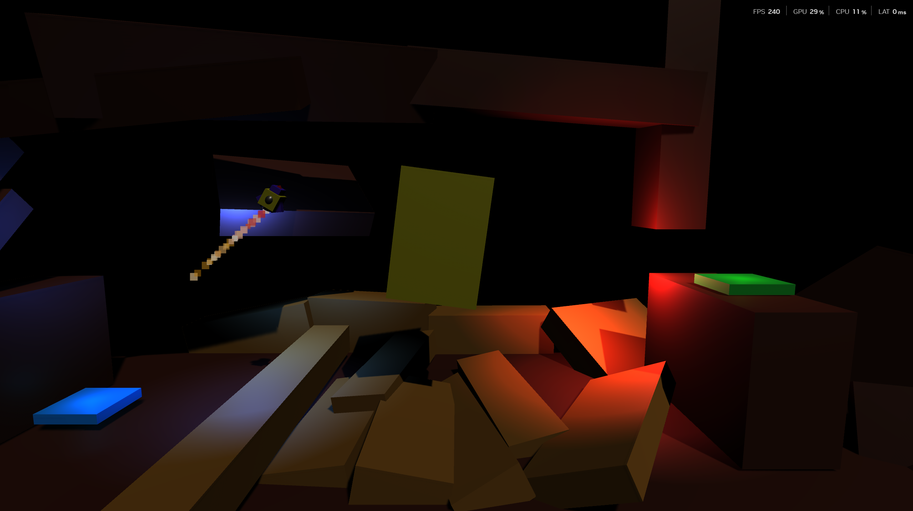
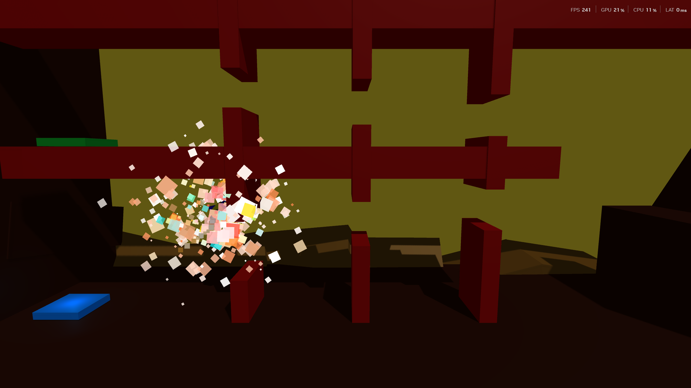
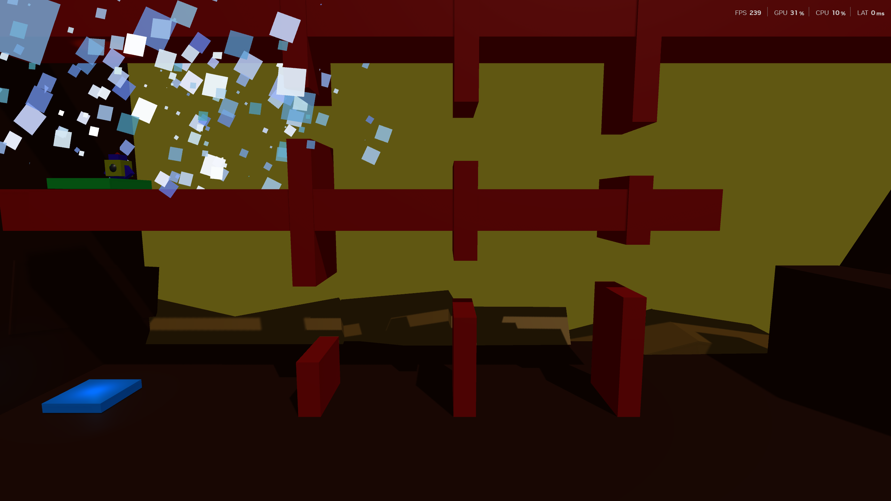
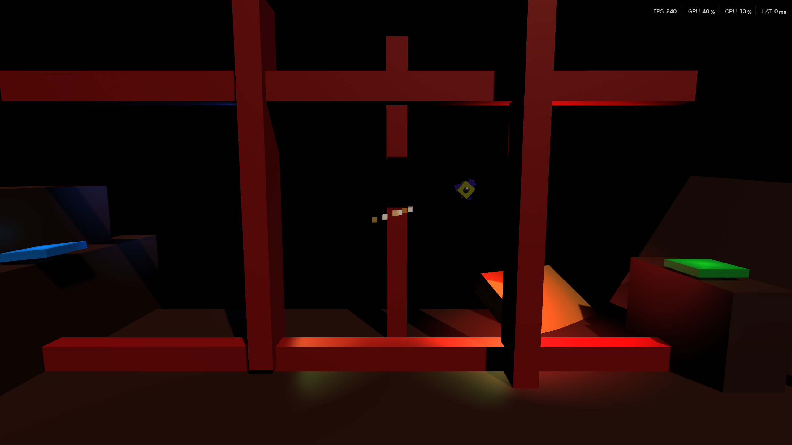
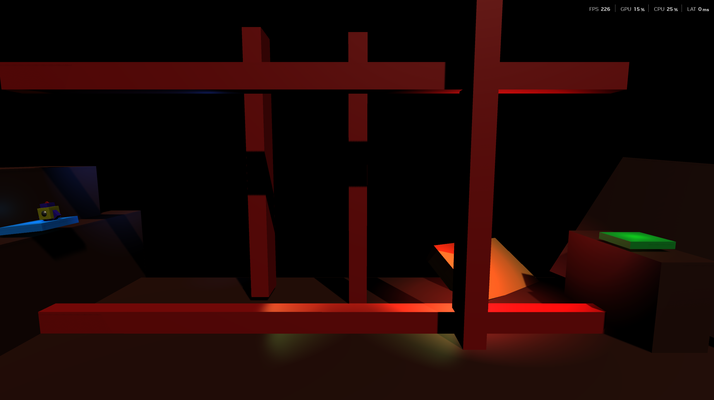
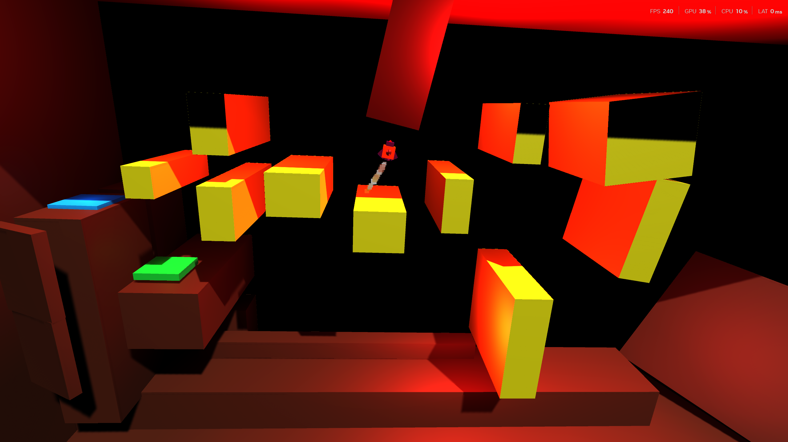

# 🚀 Rocket Game

Rocket Game is a simple 2.5D rocket control game built with Unity and C#.  
The goal is to guide the rocket safely from one point to another while avoiding obstacles and completing challenging levels.

The game focuses on smooth movement mechanics, precision control, and fun level-based gameplay.

---

# 📸 Screenshots

## Gameplay 1



## Gameplay 2



## Gameplay 3



## Gameplay 4



## Gameplay 5



## Gameplay 6



---

# 🎮 Features

- 🚀 Physics-based rocket movement
- 🔄 Rotation and thrust mechanics
- 🧩 Challenging levels
- 🔊 Sound effects for success and failure
- 🎨 Fully custom-designed rocket and levels
- 🛠 Built using Unity and C#

---

# 🎯 Controls

| Key | Action |
|------|--------|
| `Space` | Thrust Up |
| `A` / `Left Arrow` | Rotate Left |
| `D` / `Right Arrow` | Rotate Right |

---

# 🧱 Project Structure

```bash
Rocket-Game/
│
├── Assets/
├── GamePlay.png
├── GamePlay2.png
├── GamePlay3.png
├── GamePlay4.png
├── GamePlay5.png
├── GamePlay6.png
│
├── Packages/
├── ProjectSettings/
└── README.md
```

# 🚀 Getting Started

## Requirements

- Unity
- Visual Studio or any C# IDE

## Run the Project

1. Clone the repository

```bash
git clone https://github.com/KareemShuhadh/rocket-game.git
```

2. Open the project in Unity

3. Load the main scene

4. Press Play ▶️

---

# 📚 What I Learned

This project helped me improve my skills in:

- Unity physics
- C# scripting
- Game mechanics
- Level design
- Audio systems
- Player movement systems

---

# 📌 Future Improvements

Possible future updates:

- More levels
- Better visual effects
- Fuel system
- Timer and score system
- UI improvements
- Main menu system

---

# 👨‍💻 Author

Designed and developed entirely by me using Unity and C#.
